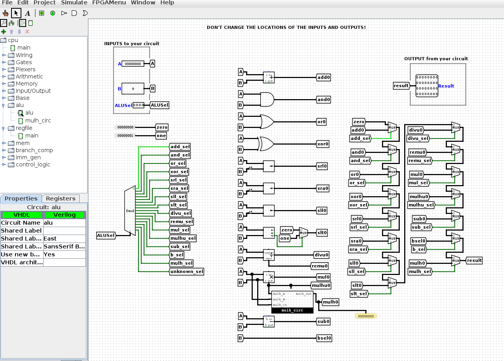
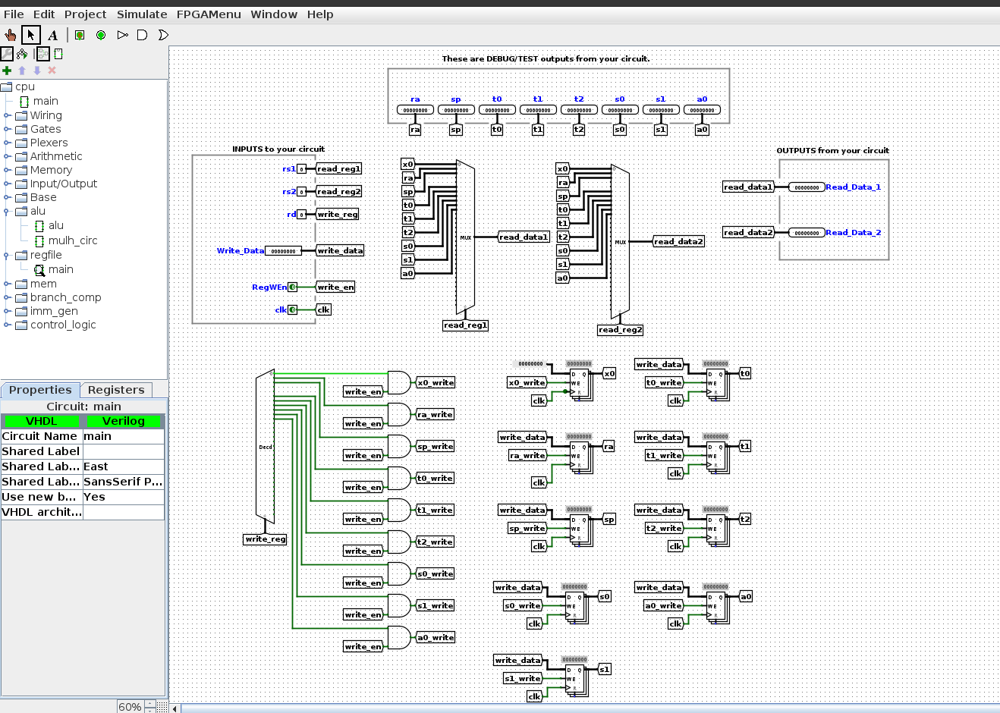
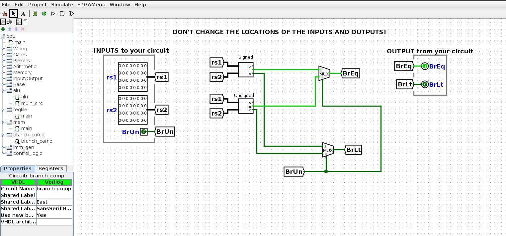
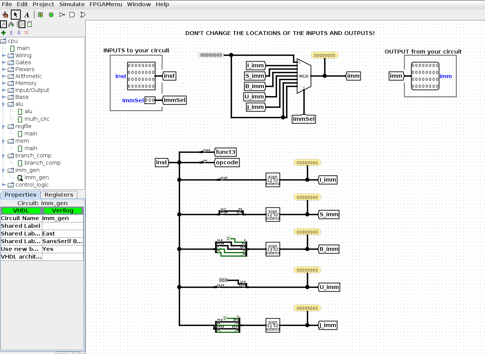
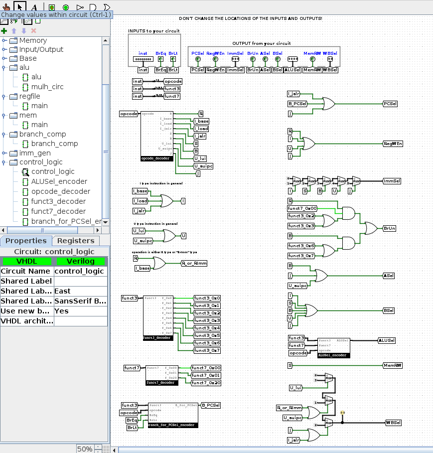
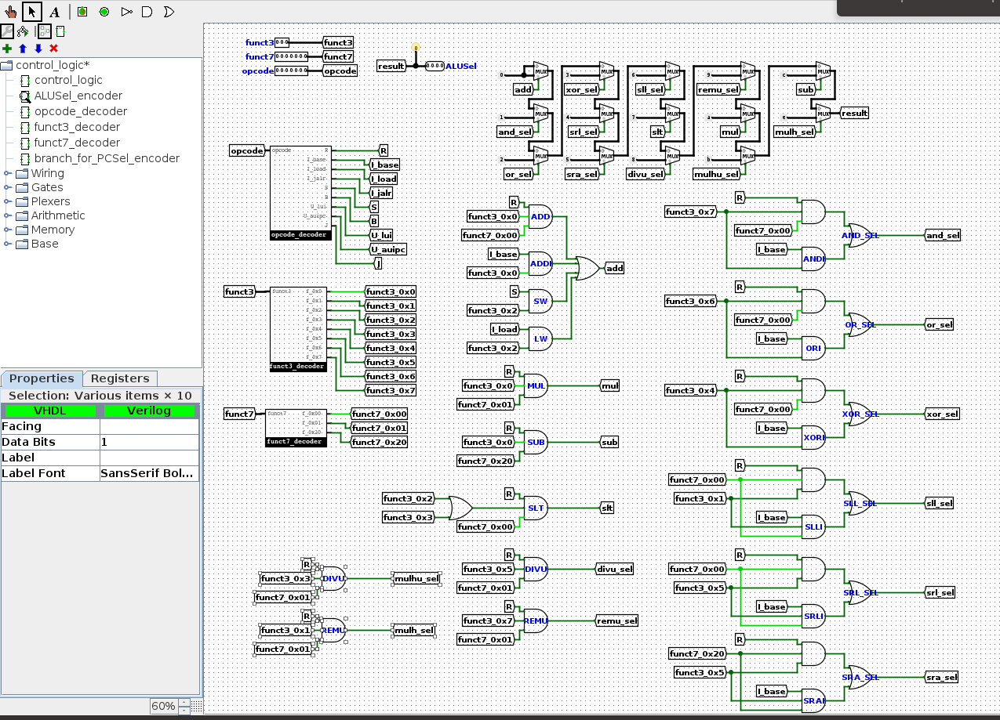

# CS61CPU

Look ma, I made a CPU! Here's what I did:

## CPU

## Arithmetic Logic Unit (ALU)

## Register file

## Branch comparator

## Immediate constant generator

## Control Logic

### ALU operation signal encoder

